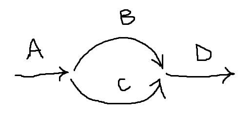

# Семафор

## Введение
- Способ синхронизации параллельных процессов при критических условиях

## Основное поределение
> семафор - ... со специальными переменными:
>   - P( S) (Открытие)
>   - V( S) (Закрытие)
>   - (Числовое поле, обычно Int или Bool)

P( S)
- Всегда связана с декрементацией (уменьшение) поля симфора (обычно на 1). 
Затем проверяется условие. 
Если оно выполняется, то процесс встает в очередь к семафору

V( S)
- Всегда связана с инкрементацией (увеличение) поля симфора (обычно на 1). 
Затем проверяется условие. 
Если оно выполняется, то процесс Д-блокируется (из состояния блокировки в состояние готовности)

> Идея семафора Дейкстры:
> Если ... 

Семафоры делятся на:
- Числовые

    Числовое значение меняется в некотором интервале (от -10 до 100)
- Двоичные

    Числовое значение может принимать только 1 или 0

*Пример*

    Есть 2 возможные реализации
    1. ... 
    2. Будет блокироваться процесс с на ибольшим приоритетом

**Требуется запомнить процессы P(S) и V( S)**

1. .
2. Если процесс блокируется, то он попадает в процесс пассивного ожидания

- Идея семафорного программирования появилась раньше ООП
- Семафоры названы примитивами, т.к. являются низкоуровневыми решениями

**Семафоры - одна из тем на экзамене**

# Задание в лабораторной работе 2



Таблица
| Имя | t | Pr | F |
| --- | --- | --- | --- |
| A | 1 | 0 | M[1..n] |
| B | 1 | 1 | F1(M) |
| C | 1 | 1 | F2(M) |
| D | 1 | 2 | F3( F1, F2) |

Заметки
- Самый хороший способ оформить данную задачу как потоки. Есть во всех системах программирования.
- Преимущества потоков:
  * Могут вызывать друг друга
  * Могут смотреть состояния друг друга
- Результат работы - оформленный протокол
- Графически изобразить динамику задач (ProgressBar, Gaug). Можно построить искусственные задержки при помощи пустых циклов
- Интерфейс (кнопки) - кнопка запускает один из процессов, скролл окно с выводом, 9 линеечек
  
# Задача поставщика и потребителя

- Взаимодействует два процесса - поставщик и потребитель
- Поставщик создает сообщения и записывает их в пул буфферов (для каждого сообщения свой буффер)
- Потребитель считывает сообщения из пула буфферов
- Пока запись не закончена, чтение запрещено
- Пока чтение не закончилось, не надо записывать ничего нового (требуется чтобы чтение было заверешенно полностью)
- Процессы поставщика и потребителя должны соблюдать числовое количество ... в буфферах

Пример
```
...
```
Параметры synchronyse
- ...
- Имя функции вывода (как входящий параметр)

Можно не использовать synchronyse, но ее рекомендуют использовать

# Задача "читателя-писателя"